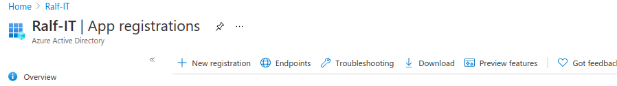
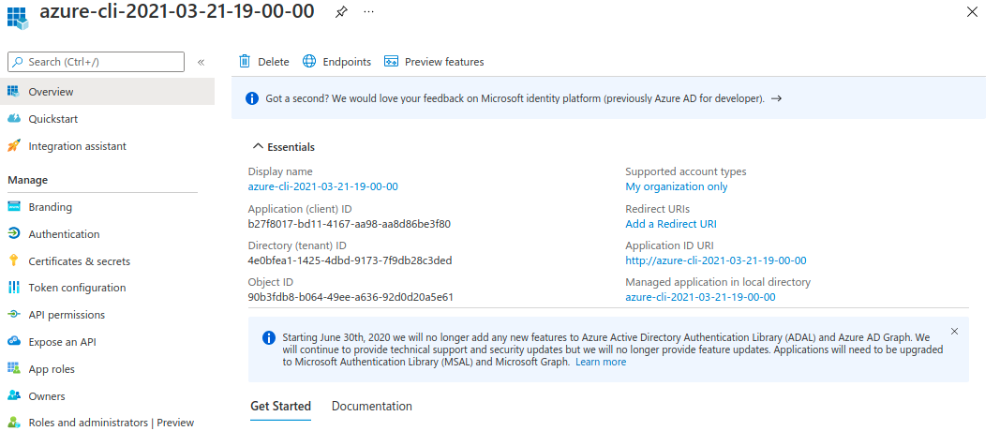
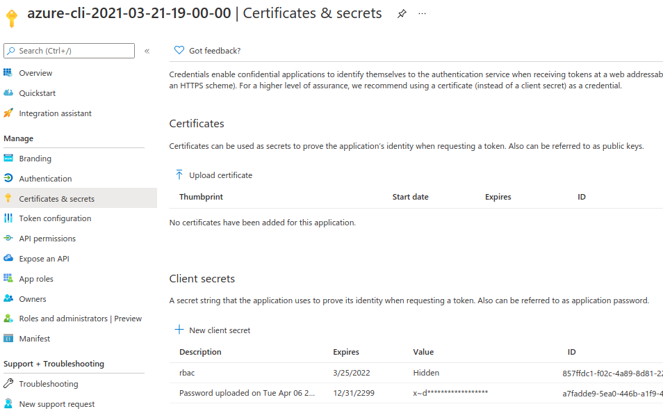

## Setup service principal for whole subscription

### Via Azure (Portal) Shell

[Authenticate with service principal - Azure Container Registry](https://docs.microsoft.com/en-us/azure/container-registry/container-registry-auth-service-principal)

### Via Azure Portal

#### Go to AAD 


#### App Registrations 


#### new registration -> ...



#### Grab `AAD_CLIENT_ID` and `ADD_TENANT_ID`



#### Create `secret` and save as `ACR_PASS`




#### Assign role to subscription to controll all resources in subscription:


#### Or assing role to Container Registry to controll only it:


#### Here set service principal as `Owner`


# Development

Go and fill in `.env` and `.secrets.env` with data needed by next steps.

## Setup Azure Resources

First Key Vault (AKV) if not already exists. In powershell...

```ps1
powershell setup-key-vault.ps1
powershell setup-managed-identity-and-container-registry.ps1
```

Now in bash. Create RBAC ASP and save secret as key to AKV.

```sh
bash setup-rbac-service-principal-save-to-key-vault.sh
```

It will recreate .rbac.secrets.env file used when pushing.

## Build and ship steps


> Note: first follow prep steps

```sh
# build and test
docker-compose up --build
# build only
docker-compose build
# push to registry
bash push-images-to-azure-container-registry.sh
```

# Scripts in tmp

Probably not needed. 