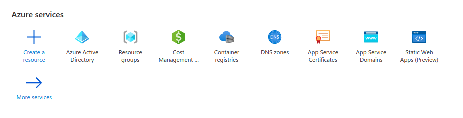
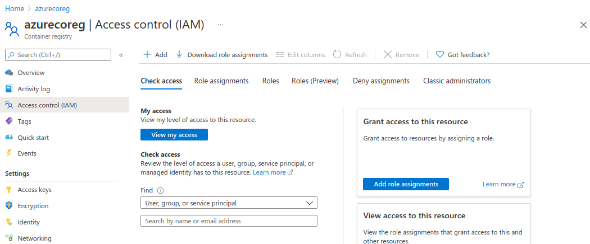

# Setup service principal

## Via az cli
[Authenticate with service principal - Azure Container Registry](https://docs.microsoft.com/en-us/azure/container-registry/container-registry-auth-service-principal)

## Via Azure Portal

Go to AAD -> App Registrations -> new registration -> ...

Create `secret` and save as `ACR_PASS`

Assign role to subscription to controll all resources in subscription:

Or assing role to Container Registry to controll only it:

Here set service principal as `Owner`

# Issues

## EOL Windows vs Linux

Linux containers require LF endings. Change by: Settings -> EOL -> Files eol \n.

Then for each file: ctrl + shift + p -> Change End of Line Sequence -> LF

## Cannot connect to mysql container

In case of error: `pymysql.err.OperationalError: (1045, "Access denied for user 'dbuser'@'172.24.0.3' (using password: YES)")` we have to remove volumes created by mysql container because DB was changed and this volumes are outdated. We remove volumes with `docker-compose rm -v`

## Cosmosdb locally require emulator

TODO connect from conainer to emulator. 

[Install and develop locally with Azure Cosmos DB Emulator](https://docs.microsoft.com/en-us/azure/cosmos-db/local-emulator?tabs=cli%2Cssl-netstd21#export-the-ssl-certificate)

[Networking features in Docker Desktop for Windows](https://docs.docker.com/docker-for-windows/networking/#there-is-no-docker0-bridge-on-windows#i-want-to-connect-from-a-container-to-a-service-on-the-host)

[Access to Cosmos db emulator on local machine from Linux docker](https://stackoverflow.com/questions/56860749/access-to-cosmos-db-emulator-on-local-machine-from-linux-docker)