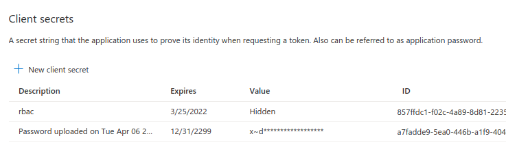

# Development

## Setup Azure Resources

First Key Vault (AKV) if not already exists. In powershell...

```ps1
powershell setup-key-vault.ps1
```

Now in bash. Create RBAC ASP and save secret as key to AKV.

```sh
bash setup-rbac-service-principal-save-to-key-vault.sh
```

It will recreate .rbac.secrets.env file used when pushing.

## Build and ship steps

Go and fill in `.env` with data needed by docker-compose build.

> Note: first follow prep steps

```sh
# build and test
docker-compose up --build
# build only
docker-compose build
# push to registry
bash push-images-to-azure-container-registry.sh
```

# Prep steps


```ps1
$LOCATION="germanywestcentral"
$AMI_NAME="myManagedIdentity002"
$ARG_NAME="myResourceGroup002" 
```


## Step 0 - Create Managed Identity (AMI)

```ps1
az identity create   --resource-group ${ARG_NAME}  --name ${AMI_NAME}
$identityID=(az identity show --resource-group ${ARG_NAME}  --name ${AMI_NAME} --query 'id' --output tsv)
$identityPrincipalID=(az identity show --resource-group ${ARG_NAME} --name ${AMI_NAME} --query 'principalId' --output tsv)
```

## Step 1 - Create Key Vault (AKV)

```sh
$KeyVault = Get-AzKeyVault  -Name ${AKV_NAME} -ResourceGroupName ${ARG_NAME} 
```

## Step 1.1 - Add full permissions for self to AKV

```ps1
# Grant full permissions to KV to current user
$UserObjectId = (az ad signed-in-user show --query 'objectId' --output tsv)

az keyvault set-policy `
  --resource-group ${ARG_NAME}  `
  --name ${AKV_NAME} `
  --object-id $UserObjectId `
  --certificate-permissions backup create delete deleteissuers get getissuers import list listissuers managecontacts manageissuers purge recover restore setissuers update `
  --key-permissions backup create decrypt delete encrypt get import list purge recover restore sign unwrapKey update verify wrapKey `
  --secret-permissions backup delete get list purge recover restore set `
  --storage-permissions backup delete deletesas get getsas list listsas purge recover regeneratekey restore set setsas update 
```

## Step 1.2 - Add some permisssions for AMI to AKV

```ps1
az keyvault set-policy `
  --resource-group ${ARG_NAME}  `
  --name ${AKV_NAME} `
  --object-id $identityPrincipalID `
  --key-permissions get unwrapKey wrapKey `
  --secret-permissions delete get list purge recover restore set
```

## Step 1.3 - Create key in AKV that we will use by ACR

```ps1
az keyvault key create `
  --name "myKey" `
  --vault-name ${AKV_NAME} `

$keyID=(az keyvault key show `
  --name "myKey" `
  --vault-name ${AKV_NAME} `
  --query 'key.kid' --output tsv)

$keyID=(echo $keyID | sed -e "s/\/[^/]*$//")
```

## Step 2 - Setup Azure Container Registry (ACR) with AMI and AKV key

```ps1
#################################################################################
#### Create Container Registry
#################################################################################

#                         BASIC	            STANDARD	        PREMIUM
# Price per day	          $0.167	          $0.667	          $1.667
# Included storage (GB)	  10	              100	              500
#                                                             * Premium offers 
#                                                             * enhanced throughput 
#                                                             * for docker pulls 
#                                                             * across multiple, 
#                                                             * concurrent nodes
# Total web hooks	        2	                10	              500
# Geo Replication	        Not Supported	    Not Supported	    Supported
#                                                             * $1.667 per 
#                                                             * replicated region

# https://azure.microsoft.com/en-us/pricing/details/container-registry/

# TODO only premium support encryption, do we need it?
#      --identity and --key-encryption-key must be both supplied
#      Premium is paid $1.677 per day. Maybe can spend few bucks?
az acr create `
  --resource-group ${ARG_NAME} `
  --name $ACR_NAME `
  --identity $identityID `
  --key-encryption-key $keyID `
  --sku Premium

# TODO Maybe use basic, price is 
# az acr create `
#   --resource-group ${ARG_NAME} `
#   --name $ACR_NAME `
#   --sku Basic
```


## Step Optional 1 - Setup service principal for whole subscription

### Via az cli

[Authenticate with service principal - Azure Container Registry](https://docs.microsoft.com/en-us/azure/container-registry/container-registry-auth-service-principal)

### Via Azure Portal

Go to AAD -> App Registrations -> new registration -> ...


Create `secret` and save as `ACR_PASS`





Assign role to subscription to controll all resources in subscription:


Or assing role to Container Registry to controll only it:


Here set service principal as `Owner`


## Step Optional 2 - variables and secrets

Having principal data go and fill in `.env` and `.secrets.env`.

First one hold data for docker-compose build and pushing to ACR. 

Second have creds for pushing to ACR.


# Issues

## EOL Windows vs Linux

Linux containers require LF endings. Change by: Settings -> EOL -> Files eol \n.

Then for each file: ctrl + shift + p -> Change End of Line Sequence -> LF


## Cannot connect to mysql container

In case of error: `pymysql.err.OperationalError: (1045, "Access denied for user 'dbuser'@'172.24.0.3' (using password: YES)")` we have to remove volumes created by mysql container because DB was changed and this volumes are outdated. We remove volumes with `docker-compose rm -v`

## Cosmosdb locally require emulator

TODO connect from conainer to emulator. 

[Install and develop locally with Azure Cosmos DB Emulator](https://docs.microsoft.com/en-us/azure/cosmos-db/local-emulator?tabs=cli%2Cssl-netstd21#export-the-ssl-certificate)

[Networking features in Docker Desktop for Windows](https://docs.docker.com/docker-for-windows/networking/#there-is-no-docker0-bridge-on-windows#i-want-to-connect-from-a-container-to-a-service-on-the-host)

[Access to Cosmos db emulator on local machine from Linux docker](https://stackoverflow.com/questions/56860749/access-to-cosmos-db-emulator-on-local-machine-from-linux-docker)